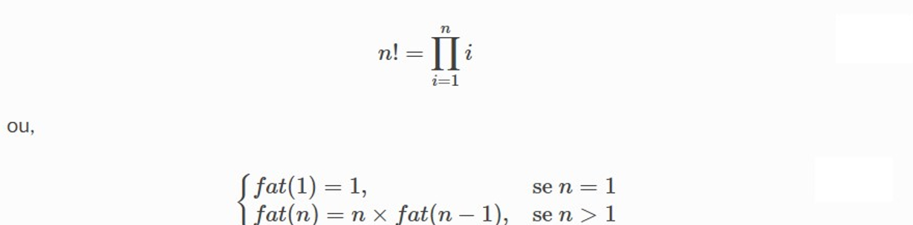
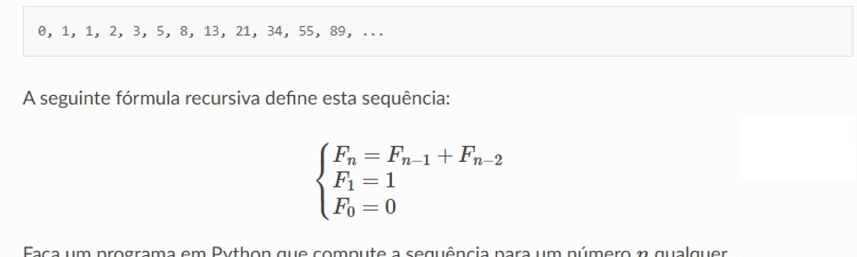
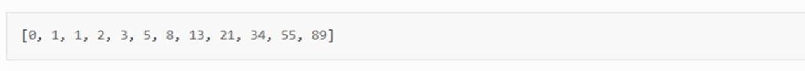
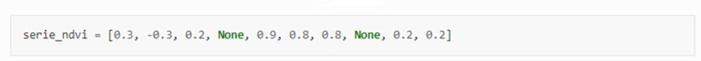

**Atividade de Python**  

- 1  Escreva um programa em Python que leia um numero inteiro n entre 1 e 10  e compute o fatorial desse numero 
  .Lembre-se que o fatorial de um numero n é definido como: 

  

-2 A sequencia Fibonacci é uma sequencia de numeros inteiros , comecando por 0 e 1 ,onde cada termo subsequente corresponde 
a soma dos dois anteriores: 

-3 considere a seguinte lista: 

Faça um programa em Python que realize a soma dos valores nessa lista e escreva o valor da soma: 

-4 Dada a lista de valores : 

-Quantidade de valores invalidos ( neste caso:None)
-Quantidade de valores validos.

-5  escreva um programa em pynthon que verefique se um número é primo ou não:   

-6 Escreva um programa em pynthon que gere a tabela de multiplicação de 1 a 10.

-7 Considerando que o usuário entre com 3 números inteiros, identifique qual é o maior deles.

-8 Dado uma frase de entrada, procura uma letra desejada (informa a quantidade existente, se existir), devidamente informada pelo usuário.

-9 Crie uma matriz [10,10] e a torne uma matriz identidade.

-10  Crie um programa que mostre a frequência relativa de vogais em um texto.

